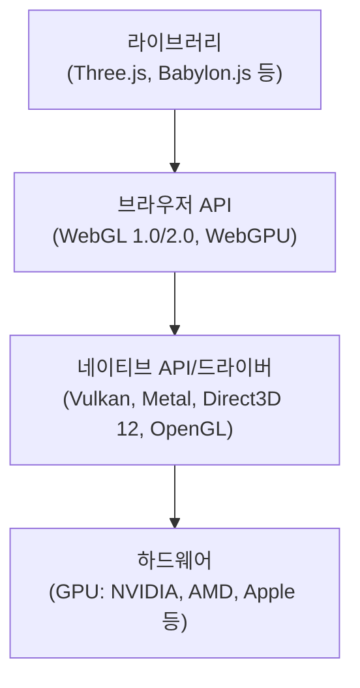
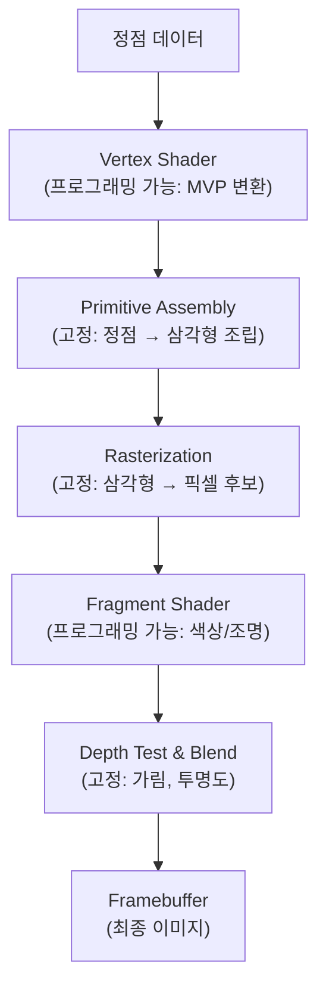
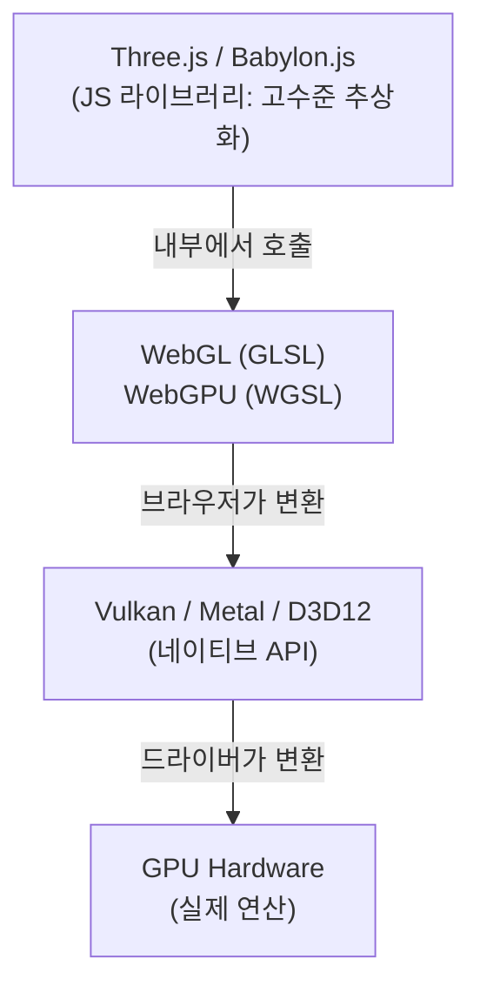

# Web3D Reference

> **Technical Reference**  
> GPU → OpenGL → WebGL → WebGPU → Shader → Three.js — 전체 기술 스택의 계층과 관계를 정리한다.

---

## 01. 전체 계층 구조

웹 그래픽스 기술은 하드웨어부터 라이브러리까지 명확한 계층을 이룬다. 각 계층은 아래 계층을 추상화한다.



**핵심**: Three.js는 WebGL/WebGPU를 내부에서 호출하는 라이브러리이고, WebGL/WebGPU는 브라우저가 네이티브 GPU 드라이버에 접근하기 위한 JavaScript API이다. 서로 "대체"가 아니라 "위-아래" 관계이다.

---

## 02. GPU

**GPU(Graphics Processing Unit)**는 수천 개의 작은 코어로 동일한 연산을 대량의 데이터에 동시 실행하는 **병렬 처리** 전용 하드웨어이다.

화면의 수백만 픽셀에 같은 색상 계산을 동시에 적용해야 하므로, 이 구조가 그래픽 렌더링에 정확히 맞는다. 셰이더 프로그램은 이 GPU 코어들 위에서 실행되는 작은 프로그램이다.

| 구분        | CPU               | GPU                  |
| ----------- | ----------------- | -------------------- |
| 코어        | 소수 (4~24), 강력 | 수천 개, 단순        |
| 설계        | 복잡한 순차 작업  | 단순 연산 대량 병렬  |
| 적합한 작업 | 로직, I/O, 분기   | 행렬 연산, 픽셀 처리 |

---

## 03. OpenGL / OpenGL ES

**OpenGL**은 1992년에 공개된 크로스 플랫폼 그래픽스 API **명세(specification)**이다. GPU를 통해 2D/3D를 렌더링하기 위한 함수 인터페이스를 정의하며, 실제 구현은 각 GPU 제조사(NVIDIA, AMD 등)의 드라이버가 담당한다.

**OpenGL ES**는 모바일/임베디드용 경량 서브셋이다. WebGL은 바로 이 OpenGL ES를 브라우저용으로 포팅한 것이다.

| 명세          | 관계                               |
| ------------- | ---------------------------------- |
| OpenGL ES 2.0 | → WebGL 1.0의 기반                 |
| OpenGL ES 3.0 | → WebGL 2.0의 기반                 |
| Vulkan        | → OpenGL의 공식 후속 (현대적 설계) |

---

## 04. WebGL

**WebGL**은 브라우저에서 GPU 가속 그래픽을 렌더링하기 위한 JavaScript API이다. HTML `<canvas>` 위에서 동작하며, 플러그인이 필요 없다.

핵심 특징은 **상태 기계(state machine)** 모델이다. 전역 상태(현재 버퍼, 셰이더, 블렌딩 모드 등)를 설정한 뒤 드로우 콜을 호출하면, 그 시점의 상태 조합으로 렌더링된다.

### 코드 예시 — 삼각형

```javascript
const gl = canvas.getContext("webgl2");

// Vertex Shader: 정점 위치 결정
const vsSource = `#version 300 es
  in vec2 aPos;
  void main() { gl_Position = vec4(aPos, 0.0, 1.0); }
`;

// Fragment Shader: 픽셀 색상 결정
const fsSource = `#version 300 es
  precision highp float;
  out vec4 color;
  void main() { color = vec4(1.0, 0.2, 0.2, 1.0); }
`;

// 셰이더 컴파일 → 프로그램 링크 → 버퍼 생성 → 정점 업로드 → 드로우
// ... (약 30줄의 보일러플레이트 필요)
gl.drawArrays(gl.TRIANGLES, 0, 3);
```

**요점**: 삼각형 하나를 그리는 데 셰이더 작성, 컴파일, 버퍼 생성, 어트리뷰트 바인딩 등 약 40줄이 필요하다. 이것이 Three.js 같은 추상화 라이브러리가 존재하는 이유이다.

---

## 05. WebGPU

**WebGPU**는 W3C가 설계한 차세대 웹 그래픽스/컴퓨트 API이다. WebGL의 후속이 아니라 Vulkan, Metal, Direct3D 12의 현대적 패러다임을 웹에 가져온 완전히 새로운 설계이다.

### WebGL과의 핵심 차이

| 항목           | WebGL                   | WebGPU                         |
| -------------- | ----------------------- | ------------------------------ |
| 설계 기반      | OpenGL ES (1990년대)    | Vulkan/Metal/D3D12 (2015+)     |
| 상태 관리      | 전역 상태 기계 (암묵적) | 파이프라인 객체 (명시적, 불변) |
| 셰이더 언어    | GLSL                    | WGSL                           |
| Compute Shader | 미지원                  | 지원 (GPGPU 가능)              |
| 커맨드 모델    | 즉시 실행               | 커맨드 버퍼 기록 → 제출        |
| CPU 오버헤드   | 높음                    | 낮음                           |

### 코드 예시 — 삼각형

```javascript
const adapter = await navigator.gpu.requestAdapter();
const device = await adapter.requestDevice();
const context = canvas.getContext("webgpu");

// WGSL 셰이더 — Vertex + Fragment를 하나의 모듈에 작성
const shader = device.createShaderModule({
    code: `
  @vertex fn vs(@builtin(vertex_index) i: u32) -> @builtin(position) vec4f {
    var p = array<vec2f,3>(vec2f(0,.5), vec2f(-.5,-.5), vec2f(.5,-.5));
    return vec4f(p[i], 0, 1);
  }
  @fragment fn fs() -> @location(0) vec4f {
    return vec4f(1, 0.2, 0.2, 1);
  }
`,
});

// 파이프라인 생성 → 커맨드 인코딩 → GPU 제출
const pipeline = device.createRenderPipeline({
    /* ... */
});
const encoder = device.createCommandEncoder();
// ... renderPass 설정, draw(3), end()
device.queue.submit([encoder.finish()]);
```

---

## 06. Shader (셰이더)

**셰이더**는 GPU에서 병렬로 실행되는 작은 프로그램이다. 개발자는 "입력 하나에 대한 처리"만 작성하면, GPU가 이를 모든 정점/픽셀에 동시 적용한다.

### 주요 셰이더 종류

| 종류                | 실행 단위     | 역할                                  |
| ------------------- | ------------- | ------------------------------------- |
| **Vertex Shader**   | 정점마다      | 3D 좌표 → 화면 좌표 변환 (MVP 변환)   |
| **Fragment Shader** | 픽셀 후보마다 | 최종 색상 결정 (텍스처, 조명, 그림자) |
| **Compute Shader**  | 자유 정의     | 범용 GPU 연산 (WebGPU 전용)           |

### GLSL vs WGSL

**GLSL**은 WebGL용 셰이더 언어(C 스타일 문법), **WGSL**은 WebGPU용 셰이더 언어(Rust 스타일 문법)이다.

**GLSL (WebGL)**

```glsl
// Fragment Shader — 시간에 따른 색상 변화
uniform float uTime;
out vec4 color;
void main() {
  float r = sin(uTime) * 0.5 + 0.5;
  color = vec4(r, 0.3, 0.8, 1.0);
}
```

**WGSL (WebGPU)**

```wgsl
// 동일한 로직을 WGSL로
@group(0) @binding(0) var<uniform> uTime: f32;

@fragment
fn main() -> @location(0) vec4f {
  let r = sin(uTime) * 0.5 + 0.5;
  return vec4f(r, 0.3, 0.8, 1.0);
}
```

---

## 07. 렌더링 파이프라인

3D 데이터를 2D 이미지로 변환하는 GPU의 처리 흐름이다. 프로그래밍 가능한 단계와 고정 단계가 교차한다.



---

## 08. Three.js

**Three.js**는 WebGL/WebGPU를 추상화하는 JavaScript 3D 라이브러리이다. 개발자가 셰이더 컴파일, 버퍼 관리 없이 3D 콘텐츠를 만들 수 있게 해준다.

### 핵심 객체

| 객체       | 역할                         | WebGL 대응               |
| ---------- | ---------------------------- | ------------------------ |
| `Scene`    | 모든 3D 객체를 담는 컨테이너 | 없음 (Three.js 고유)     |
| `Camera`   | 시점 정의                    | View + Projection 행렬   |
| `Mesh`     | = Geometry + Material        | VAO + Shader + Draw Call |
| `Geometry` | 형태 데이터 (정점, UV)       | Vertex/Index Buffer      |
| `Material` | 표면 속성 (색, 거칠기)       | Shader Program + Uniform |
| `Renderer` | Scene+Camera → 이미지        | 전체 WebGL 상태 관리     |

### 코드 예시 — 회전 큐브

```javascript
import * as THREE from "three";

const scene = new THREE.Scene();
const camera = new THREE.PerspectiveCamera(75, innerWidth / innerHeight);
const renderer = new THREE.WebGLRenderer();
renderer.setSize(innerWidth, innerHeight);
document.body.appendChild(renderer.domElement);

// Mesh = Geometry + Material
const cube = new THREE.Mesh(
    new THREE.BoxGeometry(),
    new THREE.MeshStandardMaterial({ color: 0x4ecdc4 })
);
scene.add(cube);
scene.add(new THREE.DirectionalLight(0xffffff));

camera.position.z = 3;

function animate() {
    cube.rotation.x += 0.01;
    cube.rotation.y += 0.01;
    renderer.render(scene, camera);
    requestAnimationFrame(animate);
}
animate();
```

**비교**: WebGL로 삼각형 하나에 ~40줄이 필요했지만, Three.js로는 조명이 있는 3D 큐브 애니메이션이 ~20줄이면 된다. 내부적으로 Three.js가 셰이더 생성, 버퍼 관리, 행렬 계산, 드로우 콜을 모두 자동 처리한다.

### 커스텀 Shader 사용

내장 Material이 부족할 때 `ShaderMaterial`로 직접 GLSL을 작성할 수 있다. Three.js의 Scene Graph와 행렬 관리는 그대로 쓰면서 픽셀 효과만 직접 제어하는 구조이다.

```javascript
new THREE.ShaderMaterial({
    uniforms: { uTime: { value: 0 } },
    vertexShader: `
    varying vec2 vUv;
    void main() {
      vUv = uv;  // Three.js가 자동 제공
      gl_Position = projectionMatrix * modelViewMatrix * vec4(position, 1.0);
    }
  `,
    fragmentShader: `
    uniform float uTime;
    varying vec2 vUv;
    void main() {
      float wave = sin(vUv.x * 10.0 + uTime) * 0.5 + 0.5;
      gl_FragColor = vec4(vec3(wave, 0.3, 0.8), 1.0);
    }
  `,
});
```

---

## 09. 핵심 용어 사전

### 데이터 관련

| 용어             | 정의                                                                 |
| ---------------- | -------------------------------------------------------------------- |
| **Vertex**       | 3D 공간의 한 점. 위치, 법선, UV 등의 속성을 가짐                     |
| **Normal**       | 표면에 수직인 단위 벡터. 조명 계산의 핵심                            |
| **UV**           | 정점에 할당된 2D 텍스처 좌표. 텍스처가 표면에 어떻게 입혀질지 결정   |
| **Texture**      | GPU 메모리의 이미지 데이터. 색상, 법선, 높이 등 다양한 정보를 인코딩 |
| **Buffer (VBO)** | 정점 데이터를 GPU 메모리에 저장하는 공간                             |
| **Index Buffer** | 정점 중복 없이 인덱스로 삼각형을 구성하는 버퍼                       |

### 셰이더 관련

| 용어          | 정의                                                                     |
| ------------- | ------------------------------------------------------------------------ |
| **Uniform**   | 셰이더에 전달하는 상수. 모든 정점/픽셀에서 같은 값 (시간, 행렬, 색상 등) |
| **Attribute** | 정점마다 다른 값 (위치, 색상, UV). Vertex Shader에서만 접근              |
| **Varying**   | Vertex → Fragment로 전달되는 값. 래스터화 시 자동 보간됨                 |
| **Sampler**   | 텍스처를 읽을 때 필터링/반복 방식을 정의하는 객체                        |

### 렌더링 관련

| 용어                | 정의                                                                  |
| ------------------- | --------------------------------------------------------------------- |
| **Draw Call**       | CPU → GPU "이 데이터를 그려라" 명령. 많을수록 CPU 병목 발생           |
| **Framebuffer**     | 렌더링 결과가 기록되는 메모리 영역                                    |
| **Depth Buffer**    | Z 값을 저장해 물체 가림(occlusion)을 판정하는 버퍼                    |
| **Rasterization**   | 벡터 기하(삼각형)를 픽셀 격자의 프래그먼트로 변환하는 과정            |
| **MVP 변환**        | Model(물체 배치) × View(카메라 시점) × Projection(원근/직교) 행렬 곱  |
| **PBR**             | Physically Based Rendering. 물리 법칙 기반 재질 표현 (금속성, 거칠기) |
| **Post-Processing** | 렌더링 완료 후 2D 이미지에 적용하는 효과 (블룸, 톤매핑, FXAA 등)      |

---

## 10. 네이티브 Graphics API

브라우저 API(WebGL/WebGPU) 아래에는 OS별 네이티브 API가 존재한다. 브라우저가 내부적으로 이들을 호출하여 GPU를 구동한다.

| API             | 제공                     | 특징                                                  |
| --------------- | ------------------------ | ----------------------------------------------------- |
| **Vulkan**      | Khronos (크로스 플랫폼)  | OpenGL 후속. 저수준, 명시적 제어, 최고 성능           |
| **Metal**       | Apple (macOS/iOS)        | Apple 전용. Vulkan과 유사한 현대적 설계               |
| **Direct3D 12** | Microsoft (Windows/Xbox) | Windows 전용. 게임 산업 표준                          |
| **OpenGL**      | Khronos (크로스 플랫폼)  | 레거시. 여전히 작동하지만 신규 개발은 Vulkan으로 이동 |

**WebGPU와의 관계**: WebGPU는 특정 네이티브 API에 종속되지 않는다. Chrome은 Vulkan/Metal/D3D12 위에, Firefox는 자체 추상화(wgpu) 위에 WebGPU를 구현한다. 개발자는 이를 신경 쓸 필요 없이 동일한 WebGPU 코드를 작성한다.

---

## 11. 전체 관계 정리



- Three.js ⊃ WebGL/WebGPU 호출 (라이브러리가 API를 감싼다)
- WebGL ≈ OpenGL ES의 웹 바인딩
- WebGPU ≈ Vulkan/Metal/D3D12의 공통 추상화
- Shader = GPU에서 실행되는 프로그램 (API가 아님)
- GLSL = WebGL용 셰이더 언어
- WGSL = WebGPU용 셰이더 언어